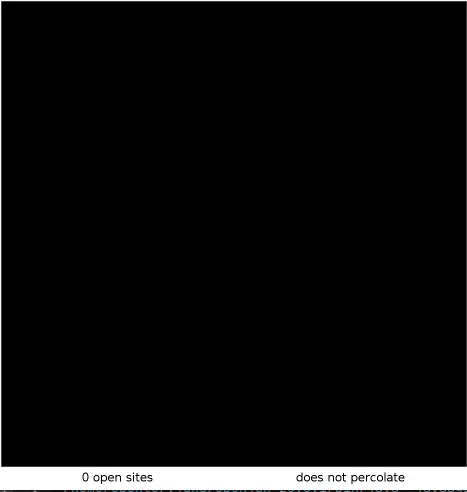
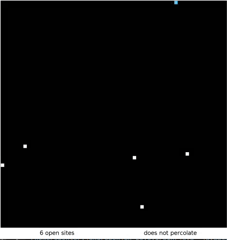

# Percolation

**The Percolation Simulation project implements a percolation simulation on an n-by-n grid,
modeling the behavior of a composite system comprised of randomly distributed insulating and
metallic materials or a porous landscape with water. The primary goal of this project is to estimate
the percolation threshold, which represents the probability of the system percolating.**




## Introduction

**Percolation is a fascinating concept that helps us understand the behavior of complex systems.
In this simulation, we explore the percolation process on an n-by-n grid,
which represents a composite material or a porous landscape. By systematically opening sites on the grid or
allowing fluids to flow, we observe the emergence of connectivity and permeability within the system.**

**Our mission is to estimate the percolation threshold, a critical probability at which the system transitions
from being blocked to becoming conductive or permeable. Through careful simulations and data analysis,
we aim to uncover the magical point where materials start to conduct electricity or fluids can freely flow.**

## Percolation Class

The `Percolation` class represents a percolation system and provides the following methods:

- `Percolation(int n)`: Constructs an n-by-n grid with all sites initially blocked.
- `void open(int row, int col)`: Opens the site at the specified row and column if it is not already open.
- `boolean isOpen(int row, int col)`: Checks if the site at the specified row and column is open.
- `boolean isFull(int row, int col)`: Checks if the site at the specified row and column is full.
- `int numberOfOpenSites()`: Returns the number of open sites in the grid.
- `boolean percolates()`: Determines if the system percolates.

## PercolationStats Class

The `PercolationStats` class performs a Monte Carlo simulation to estimate the percolation threshold. It provides the
following methods:

- `PercolationStats(int n, int trials)`: Performs `trials` independent simulations on an n-by-n grid.
- `double mean()`: Returns the sample mean of the percolation threshold.
- `double stddev()`: Returns the sample standard deviation of the percolation threshold.
- `double confidenceLo()`: Returns the low endpoint of the 95% confidence interval.
- `double confidenceHi()`: Returns the high endpoint of the 95% confidence interval.

## Algorithm and Data Structure

To efficiently model the percolation process, this project utilizes the Weighted Quick-Union algorithm,
implemented through the `WeightedQuickUnionUF` class from the Princeton Standard Library.
This data structure allows us to efficiently manage the connections between sites in the grid.

**The simulation follows a step-by-step process:**

1. Initialization: The grid is created with all sites initially blocked. A 2D boolean array (`statusGrid`) is used to
   track the open or blocked status of each site.

2. Opening Sites: Sites are opened one by one using the `open()` method. The algorithm updates the status of the site in
   the `statusGrid` and keeps a count of the number of open sites.

3. Union Operations: When a site is opened, the algorithm performs union operations to connect the newly opened site
   with its adjacent open sites. This allows for the propagation of connectivity within the system.
   The `WeightedQuickUnionUF` data structure (`grid`) manages these connections.

4. Full Sites: The algorithm determines whether a site is considered "full." A site is considered full if it is
   connected to an open site in the top row. The `full` object of type `WeightedQuickUnionUF` tracks this information.

5. Percolation Check: The algorithm checks if the system percolates, indicating the presence of a path of open sites
   from the top row to the bottom row. This check is performed using the `grid` object.

## Usage

**To use the Percolation Simulation, follow these steps:**

1. Set up the project with the Princeton Standard Library (algs4.jar) and the StdDraw library.
2. Instantiate a `Percolation` object to simulate the percolation system and open the desired sites.
3. Utilize the provided classes `PercolationVisualizer` or `InteractivePercolationVisualizer` to visualize and interact
   with the percolation process.
4. Use the `PercolationStats` class to perform multiple independent trials on an n-by-n grid and estimate the
   percolation threshold.

**To use the code, follow these steps:**

1. Ensure that you have the Princeton Standard Library (algs4.jar) in your classpath.
2. Create an instance of the `PercolationStats` class, providing the grid size `n` and the number of trials `trials`.
3. Call the appropriate methods on the `PercolationStats` object to obtain the estimated percolation threshold, mean,
   standard deviation, and confidence interval.

## Example

**The following example demonstrates the usage of the `Percolation` and `PercolationStats` classes:**

```java
int n=20; // Grid size
        int trials=100; // Number of trials

        PercolationStats stats=new PercolationStats(n,trials);
        double mean=stats.mean();
        double stddev=stats.stddev();
        double confidenceLo=stats.confidenceLo();
        double confidenceHi=stats.confidenceHi();

        System.out.println("Mean: "+mean);
        System.out.println("Standard Deviation: "+stddev);
        System.out.println("Confidence Interval: ["+confidenceLo+", "+confidenceHi+"]");
```

## Performance Analysis

The performance of the code has been optimized by using efficient algorithms and data structures. The `Percolation`
class utilizes the Weighted Quick-Union algorithm from the Princeton Standard Library, resulting in constant-time
operations for most methods. The `PercolationStats` class performs independent trials using the Monte Carlo simulation
technique, resulting in accurate estimates of the percolation threshold.

## Acknowledgements

The Percolation Simulation project is based on the work of Bob Sedgewick and Kevin Wayne.
It utilizes the Princeton Standard Library, including the `WeightedQuickUnionUF` class and
the `StdDraw` library, for efficient algorithms and graphical rendering.